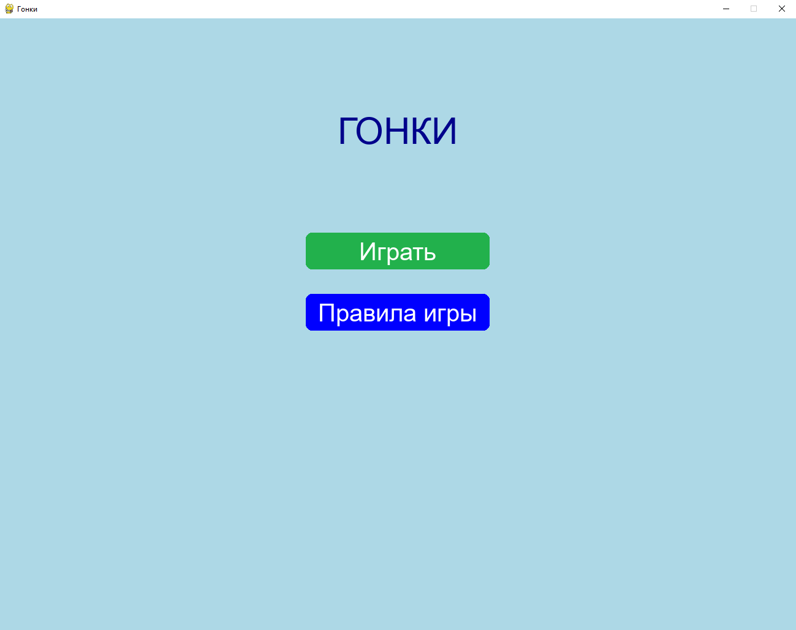
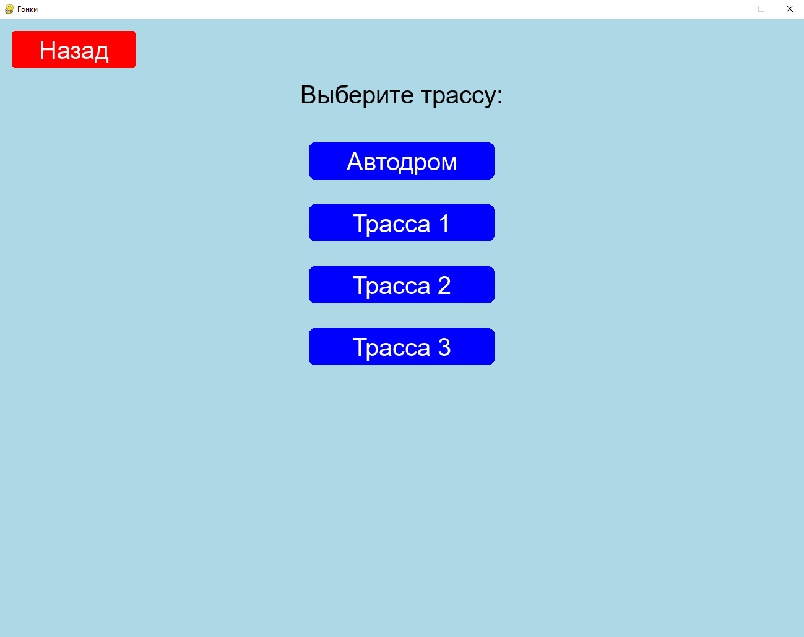
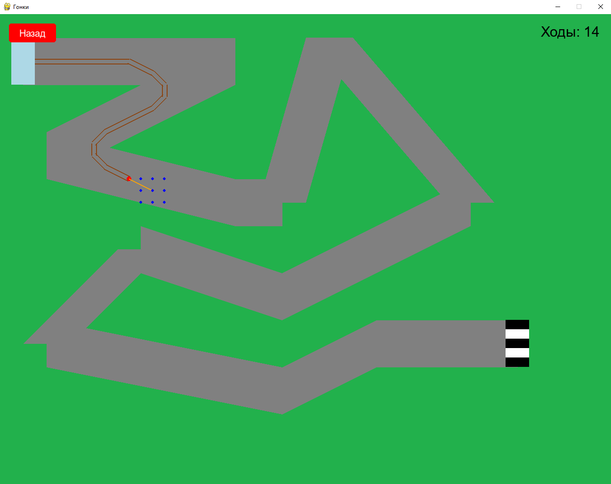

# Гоночная игра на Python
Игра про машинку с физикой инерции и разными трассами.

## Особенности
- Несколько трасс с разной сложностью
- Система инерции и планирования ходов
- Настраиваемые параметры трасс

## Установка
Требуется Python 3.6+ и библиотека PyGame:
```
pip install pygame
```

## Запуск

python race.py

## Скриншоты
 


 